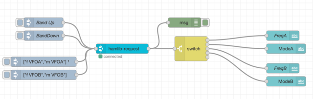

# node-red-contrib-hamlib

[NodeRed](https://nodered.org) nodes to communicate with [Hamlib](https://hamlib.github.io) to remotely control a amatuer radio transcievers.

 

** This is currently pre-release development work. **

The nodes in this collection are as follows:

- `rigctl` node to send commands to a radio (and get responses)
- `rigctl-server` configuration node that manages network communication with a `rigctld` server which controls a radio.

## Using these nodes in your flows

The `examples` directory has the example flows shown below. You can install this flow in your Node Red instance from Import / Examples. You will have to set the radio address to make the flows work with your setup.
