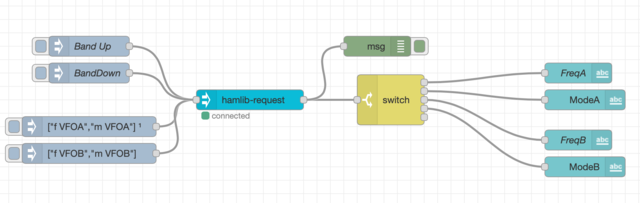

# node-red-contrib-hamlib

[NodeRed](https://nodered.org) nodes to communicate with [Hamlib](https://hamlib.github.io) to remotely control a amatuer radio transcievers.

 

This is currently pre-release development work.